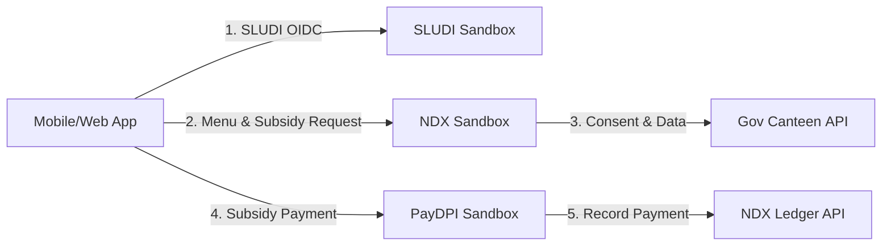

# Solution Overview

## A. System Architecture


### B. Detailed User Flows

1. SLUDI Login

- Client redirects user to SLUDI Sandbox’s OAuth 2.0/OpenID Connect endpoint.
- User authenticates via OTP/UIN and grants the app scope openid canteen.read canteen.write payment.initiate.
- Sandbox returns ID token + access token (JWT).
- Client stores tokens in secure storage (e.g., localStorage or SecureStore).

2. Fetch Menu & Subsidy Rate

Client invokes NDX endpoint:
```
GET /ndx/v1/canteens/{schoolId}/menu
Authorization: Bearer <access_token>
```
NDX verifies JWT via SLUDI’s JWKs, fetches menu data, subsidy rate, and returns JSON.

3. Consent Management

Before sensitive calls, client calls:
```
POST /ndx/v1/consent
Authorization: Bearer <access_token>
Body: { "purpose": "NutriConnect subsidy retrieval" }
```
NDX records consent event; returns consentId.

4. Trigger Subsidy Payment

User taps “Pay Subsidy”.

Client calls PayDPI:
```
POST /paydpi/v1/payments
Authorization: Bearer <access_token>
Body: {
  "beneficiary": { "uin": "1234567890" },
  "amount": 100.00,
  "currency": "INR",
  "purpose": "School Meal Subsidy"
}
```
PayDPI processes ISO 20022–formatted payment; returns paymentId + status.

5. Confirmation & Ledger Recording

On successful payment, client:

Displays receipt to user with paymentId and timestamp.

Sends ledger entry to NDX:
```
POST /ndx/v1/ledgers
Authorization: Bearer <access_token>
Body: {
  "event": "subsidy_payment",
  "paymentId": "<paymentId>",
  "amount": 100.00,
  "schoolId": "{schoolId}"
}
```
NDX confirms recording; end‑to‑end flow complete.
